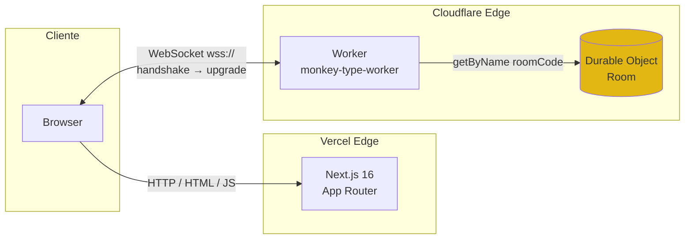
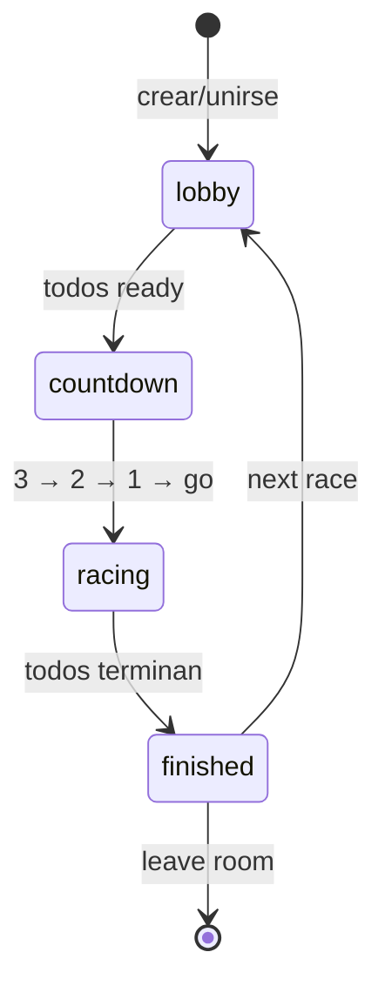

# monkey-type-multiplayer

> Carrera de tipeo multijugador en tiempo real, inspirada en [Monkeytype](https://monkeytype.com). Crea una sala, comparte el código con tus amigos y compite por el WPM más alto sobre el mismo texto.

**🟢 Demo en vivo:** https://type-multiplayer.vercel.app

---

## Tabla de contenido

- [Características](#características)
- [Arquitectura](#arquitectura)
- [Stack tecnológico](#stack-tecnológico)
- [Estructura del monorepo](#estructura-del-monorepo)
- [Desarrollo local](#desarrollo-local)
- [Variables de entorno](#variables-de-entorno)
- [Scripts disponibles](#scripts-disponibles)
- [Despliegue](#despliegue)
- [Roadmap](#roadmap)
- [Decisiones técnicas notables](#decisiones-técnicas-notables)

---

## Características

- ⚡ **Solo-practice** sin login en `/` — empieza a tipear inmediatamente. `Tab` o `Esc` generan un texto nuevo.
- 👥 **Multijugador con código de sala** en `/play` — crea o únete a una sala con un código de 5 caracteres.
- 🏁 **Sincronización en tiempo real** vía WebSockets — el texto, el countdown y el progreso de los rivales se ven en vivo.
- 📊 **Métricas estilo Monkeytype** — WPM (palabras por minuto), raw WPM, accuracy, tiempo total, ranking final.
- 🛠 **Configuraciones de carrera** (solo-practice) — modo `words` (10/25/50/100) o modo `time` (15/30/60s), toggle de **puntuación**, persistencia en `localStorage`.
- 🔄 **Rematch instantáneo** — al terminar, "next race" reinicia la carrera con un clic.
- 🎨 **5 temas** — dracula (default), warm-dark, warm-light, nord, gruvbox-dark. Cambio en vivo + persistencia local.
- 📜 **Texto que scrollea** — el caret se ancla en la segunda línea del viewport y el texto fluye estilo Monkeytype, con fade en bordes.
- ✨ **Transiciones suaves** — fade entre lobby ↔ countdown ↔ race ↔ results.
- ♻️ **Estado autoritativo en el server** — el texto, el reloj y el ranking los decide el Durable Object, no el cliente. Imposible hacer trampa cambiando el reloj local.

### Atajos de teclado

| Tecla | Contexto | Acción |
|---|---|---|
| `Tab` o `Esc` | Solo-practice (`/`) | Genera un texto nuevo |
| `Esc` | Theme switcher abierto | Cierra el dropdown |

---

## Arquitectura



**Flujo de una carrera:**



**Por qué Durable Objects:**
Cada sala es **un único DO** identificado por el código de sala (`getByName(roomCode)`). El runtime de Cloudflare garantiza que solo existe una instancia activa de ese DO en todo el planeta — eso elimina cualquier necesidad de coordinación distribuida (no hace falta Redis, ni pub/sub, ni locks). El DO mantiene en memoria la lista de jugadores, sus WebSockets activos (vía `acceptWebSocket` con hibernación nativa), el estado de la carrera y el texto. Cuando termina la última conexión, el DO se hiberna y deja de costar.

---

## Stack tecnológico

| Capa | Tecnología | Por qué |
|---|---|---|
| Frontend framework | **Next.js 16** (App Router, RSC) | SSR + client components con división automática de bundles |
| UI runtime | **React 19** | Concurrency y compatibilidad con Next 16 |
| Tipado | **TypeScript 6** estricto (`noUncheckedIndexedAccess`, `verbatimModuleSyntax`) | Catch errors en build, no en runtime |
| Estilos | **Tailwind CSS v4** + CSS custom properties | Tokens de tema cambiables en runtime — alimenta el theme switcher (5 paletas) |
| Backend realtime | **Cloudflare Workers** + **Durable Objects** | WebSockets nativos en el edge, una instancia consistente por sala |
| Persistencia DO | **SQLite-backed** (`new_sqlite_classes`) | Backend moderno y barato; el state de las salas es ephemeral, no persiste |
| WebSocket | **Hibernation API** (`ctx.acceptWebSocket`) | Conexiones sobreviven hibernación del DO sin reconectar |
| Monorepo | **Turborepo** + **pnpm workspaces** | Tipos compartidos entre web y worker sin duplicación |
| Hosting web | **Vercel** | Compat 1:1 con Next.js 16, preview URLs por PR, auto-deploy desde GitHub |
| Hosting worker | **Cloudflare Workers** | Edge global, free tier generoso, single-platform para WS + estado |

---

## Estructura del monorepo

```
monkey-type-project/
├── apps/
│   ├── web/                    # Next.js 16 client (Vercel)
│   │   ├── app/
│   │   │   ├── layout.tsx      # Root layout: ThemeProvider + Header + no-flash script
│   │   │   ├── globals.css     # CSS vars por tema, scroller, caret animation
│   │   │   ├── page.tsx        # Solo-practice (/)
│   │   │   └── play/
│   │   │       ├── page.tsx    # Lobby landing (/play)
│   │   │       └── [code]/
│   │   │           └── page.tsx # Sala (/play/XXXXX)
│   │   ├── components/
│   │   │   ├── Header.tsx      # Nav global + theme switcher dropdown
│   │   │   ├── ConfigBar.tsx   # Toggle puntuación + mode words/time + cantidad
│   │   │   └── TypingArea.tsx  # Texto + scroller + caret + métricas
│   │   ├── lib/
│   │   │   ├── settings/
│   │   │   │   ├── types.ts           # Mode, WordCount, TimeSeconds, Settings
│   │   │   │   ├── storage.ts         # localStorage con validación por field
│   │   │   │   └── SettingsProvider.tsx # Context + useSettings hook
│   │   │   ├── theme/
│   │   │   │   ├── themes.ts          # 5 paletas (dracula default, warm-dark, nord…)
│   │   │   │   ├── storage.ts         # localStorage + applyTheme()
│   │   │   │   ├── ThemeProvider.tsx  # Context + useTheme hook
│   │   │   │   └── noFlashScript.ts   # Inline script blocking en <head>
│   │   │   ├── typing/
│   │   │   │   ├── engine.ts          # Máquina de estados pura (sin React)
│   │   │   │   └── useTypingEngine.ts # Hook con keyboard listener
│   │   │   ├── room/
│   │   │   │   ├── code.ts            # Generador de códigos de sala
│   │   │   │   └── useRoomConnection.ts # Hook WebSocket con state
│   │   │   ├── storage/
│   │   │   │   └── nickname.ts        # localStorage helper
│   │   │   └── config.ts              # WORKER_WS_URL desde env
│   │   └── eslint.config.mjs
│   └── worker/                 # Cloudflare Worker (CF)
│       ├── src/
│       │   ├── index.ts        # Fetch handler, routing /room/:code/ws
│       │   └── room.ts         # Durable Object con la lógica de carrera
│       └── wrangler.jsonc      # Config del worker + DO bindings
├── packages/
│   └── shared/                 # Tipos y protocolo compartidos
│       └── src/
│           ├── room.ts         # RoomStatus, PlayerPublic, RaceResult
│           ├── protocol.ts     # ClientMessage / ServerMessage discriminated unions
│           ├── wordlist.ts     # 200 palabras inglesas comunes
│           └── textgen.ts      # generateText(count) con RNG inyectable
├── turbo.json                  # Pipeline de build (shared antes que web)
├── pnpm-workspace.yaml         # Workspaces + onlyBuiltDependencies
└── package.json                # Root workspace
```

---

## Desarrollo local

### Prerrequisitos

- **Node.js** ≥ 20
- **pnpm** ≥ 10 (`npm install -g pnpm` o usar Corepack)
- (Opcional) **Cuenta de Cloudflare** + token de API si vas a deployar el worker

### Setup

```bash
git clone https://github.com/Jjat00/monkey-type-multiplayer.git
cd monkey-type-multiplayer
pnpm install
```

> ℹ️ **Nota Windows**: el proyecto está pensado para correr nativamente en Windows o macOS/Linux. Si usas WSL, instala `node_modules` desde WSL (los binarios nativos de `workerd`/`lightningcss` son específicos de plataforma).

### Levantar todo en paralelo

```bash
pnpm dev
```

Esto arranca via Turborepo:
- **Web** en http://localhost:3000 (Next.js dev server con Turbopack)
- **Worker** en http://localhost:8787 (wrangler dev con workerd local)

El cliente apunta automáticamente a `ws://localhost:8787` cuando no hay env var configurada.

### Probar el flujo multijugador en local

1. Abre http://localhost:3000/play en una ventana
2. Mete un nickname → click "create new room" → copia la URL `/play/XXXXX`
3. Abre la misma URL en otra ventana (regular + incógnito o dos navegadores)
4. Ambos click "ready" → countdown → carrera

---

## Variables de entorno

### Web (`apps/web`)

Crea `apps/web/.env.local` (existe `.env.local.example` como plantilla):

```bash
# WebSocket URL al worker
# Default si está vacío: ws://localhost:8787
NEXT_PUBLIC_WORKER_WS_URL=ws://localhost:8787
```

En **producción** (Vercel), setear:
```
NEXT_PUBLIC_WORKER_WS_URL=wss://monkey-type-worker.<tu-subdominio>.workers.dev
```

> ⚠️ `NEXT_PUBLIC_*` se inlinea al bundle del cliente en build-time. Si la cambias, hay que rebuildear.

### Worker (`apps/worker`)

El worker MVP no requiere env vars. Para deploy, exporta el token de Cloudflare en tu shell antes de `wrangler deploy`:

```bash
export CLOUDFLARE_API_TOKEN=tu_token_de_api
```

> 🔒 **Nunca commitees tokens al repo**. Usa env vars locales o secrets del hosting provider.

---

## Scripts disponibles

Todos corren via Turborepo desde la raíz:

| Comando | Qué hace |
|---|---|
| `pnpm dev` | Arranca web (3000) + worker (8787) en paralelo |
| `pnpm build` | Build de producción de todos los packages (respeta dependencias) |
| `pnpm typecheck` | `tsc --noEmit` en todos los packages |
| `pnpm lint` | ESLint en todos los packages |
| `pnpm clean` | Borra `.next/`, `dist/`, `.turbo/` y `node_modules/` |

**Por workspace** (con `--filter`):

```bash
pnpm --filter @monkey-type/web dev
pnpm --filter @monkey-type/worker exec wrangler deploy
pnpm --filter @monkey-type/shared typecheck
```

---

## Despliegue

### Web → Vercel

1. **Importar repo** en https://vercel.com/new → seleccionar `monkey-type-multiplayer`
2. Config:
   - **Framework**: Next.js (auto-detected)
   - **Root Directory**: `apps/web` (importante)
   - **Build / Install commands**: defaults (Vercel detecta pnpm + workspace de Turbo)
3. **Environment Variables**: agregar `NEXT_PUBLIC_WORKER_WS_URL=wss://...` para Production / Preview / Development
4. **Deploy**

Vercel auto-deploya en cada push a `main`.

### Worker → Cloudflare

```bash
cd apps/worker
export CLOUDFLARE_API_TOKEN=tu_token  # template "Editar Cloudflare Workers"
pnpm exec wrangler deploy
```

Output:
```
Deployed monkey-type-worker triggers (0.99 sec)
  https://monkey-type-worker.<tu-subdominio>.workers.dev
```

**Verificar:**
```bash
curl https://monkey-type-worker.<tu-subdominio>.workers.dev/health
# → ok
```

**Auto-deploy desde GitHub** (opcional pero recomendado):
- `dash.cloudflare.com` → Workers & Pages → `monkey-type-worker` → Settings → Build → **Connect to Git**
- Repo: `Jjat00/monkey-type-multiplayer`, branch: `main`, root directory: `apps/worker`

---

## Roadmap

| Fase | Descripción | Estado |
|---|---|---|
| 1 | Scaffold del monorepo (Next + Worker + shared) | ✅ |
| 2 | Solo-practice typing engine (state machine + caret + métricas) | ✅ |
| 3a | Lobby multijugador (join/ready/disconnect en tiempo real) | ✅ |
| 3b | Race lifecycle (countdown → race → results → next race) | ✅ |
| 4 | Polish visual (theme switcher, header global, transiciones, scrolling text) | ✅ |
| 5 | Despliegue a producción (Cloudflare + Vercel) con auto-deploy | ✅ |
| 6 | Stretch goals (custom domain, leaderboards, sounds, mobile UX, tests) | 📋 Backlog |

---

## Decisiones técnicas notables

### Por qué Cloudflare Workers + Durable Objects en vez de un servidor Node tradicional

- **Una instancia por sala, automática**: `env.ROOM.getByName(roomCode)` garantiza que dos clientes con el mismo código siempre golpean el mismo DO. Sin esto necesitaríamos sticky sessions o Redis pub/sub.
- **WebSockets con hibernación**: el DO duerme cuando todos los clientes están idle pero las conexiones siguen abiertas. Costo cero cuando no hay actividad.
- **Edge deployment**: el DO se asigna al edge más cercano al primer cliente que lo crea, minimizando RTT de los keystrokes.
- **Free tier**: 100K requests/día y 13M ms de CPU/día, más que suficiente para MVP y comunidades pequeñas.

### Por qué Vercel para el frontend (en vez de Cloudflare Pages)

- Compat 1:1 con releases nuevos de Next.js. Cloudflare Pages soporta Next vía `@cloudflare/next-on-pages`, que suele rezagarse semanas en major releases.
- Preview URLs automáticas por PR — feedback loop rápido para Fase 4.
- El cliente se conecta al worker vía WSS sin proxy, así que no hay penalización por tener web y worker en diferentes plataformas.

### Por qué un motor de tipeo puro separado de React

`apps/web/lib/typing/engine.ts` es una máquina de estados sin imports de React. Eso permite:
- **Tests unitarios triviales** (próximo en backlog)
- **Reuso server-side** para validación anti-cheat futura
- **Mutaciones rápidas**: el hook lo usa con un `useRef` para evitar batching de keystrokes bajo carga (los `setState` de React 18 podían perder caracteres a >100 wpm)

### Por qué dos canales de estado (room_state vs peer_progress)

- **`room_state`**: snapshot completo de la sala, broadcast solo en eventos importantes (join, ready toggle, finish). Bajo throughput.
- **`peer_progress`**: mensaje ligero (charIndex + wpm) cada 150ms por jugador. Alto throughput pero payload mínimo.

Esto evita re-broadcastear el snapshot completo de la sala en cada keystroke, ahorrando bandwidth y CPU del DO.

### Por qué el theme system usa CSS custom properties (no Tailwind dark mode)

Tailwind solo soporta 2 modos (`dark:` prefix). Para 5+ temas necesitamos vars CSS — exactamente lo que tiene `globals.css`. Cambiar tema = sobrescribir `--color-*` en `<html>` → todas las utilidades Tailwind se actualizan sin re-renderizar React.

Para evitar el "flash of default theme" cuando un usuario tiene un tema custom guardado, hay un **script inline blocking** en `<head>` (`lib/theme/noFlashScript.ts`) que lee `localStorage` y aplica las vars antes de que React hidrate. Es el mismo patrón que usa `next-themes`. Tradeoff: ~1KB inline en cada response, eliminado el flash visual.

### Por qué el caret vive fuera del scroller del texto

El `TypingArea` usa un wrapper interno con `transform: translateY(...)` para scrollear texto estilo Monkeytype (caret anclado en línea 2). Si el caret estuviera dentro del wrapper, se traduciría junto con él (doble movement) y se clipearía por el `overflow: hidden` del scroller. Lo dejé fuera, en el container relative parent — su `getBoundingClientRect` sigue tracking el span target (que sí está dentro del wrapper traducido), así que el caret se posiciona correctamente sin clip.

### Por qué desactivamos algunas reglas de `react-hooks` v6

`react-hooks/purity`, `react-hooks/refs` y `react-hooks/set-state-in-effect` (nuevas en eslint-plugin-react-hooks v6+) rechazan tres patrones legítimos que usamos:
1. **Ref-as-state** en `useTypingEngine` — optimización medida para no perder keystrokes
2. **`setState` post-mount** para hidratar desde `localStorage` — evita SSR/CSR mismatch
3. **`performance.now()` en render** para métricas live — ningún state deriva de eso

Justificación documentada en `apps/web/eslint.config.mjs`.

---

## Acknowledgements

Este proyecto está **inspirado** en [Monkeytype](https://github.com/monkeytypegame/monkeytype) (también GPL-3.0). No incluye código fuente de Monkeytype — el motor, los hooks, los componentes, el worker y el protocolo se escribieron desde cero. La wordlist (`packages/shared/src/wordlist.ts`) es selección y orden propios. Los temas `warm-dark` y `warm-light` están inspirados en el tema `serika` de Monkeytype pero llevan nombres y atribución distintos.

Paletas de color de terceros incluidas:
- **nord** — [Nord theme](https://www.nordtheme.com) por Sven Greb (MIT)
- **dracula** — [Dracula theme](https://draculatheme.com) por Zeno Rocha (MIT)
- **gruvbox** — [Gruvbox theme](https://github.com/morhetz/gruvbox) por Pavel Pertsev / morhetz (MIT)

El nombre y logo de Monkeytype son marcas del proyecto Monkeytype; este repositorio no usa ninguno.

## Licencia

[GPL-3.0](LICENSE) — software libre con copyleft. Podés usar, modificar y redistribuir el código bajo los mismos términos. Cualquier derivado distribuido también debe liberarse bajo GPL-3.0 con su código fuente disponible.
