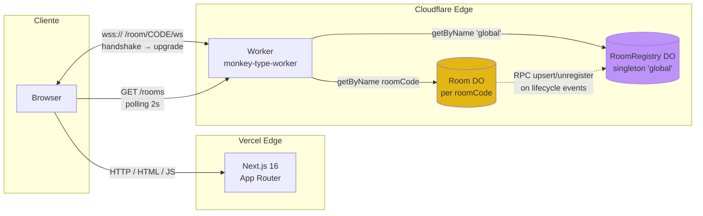
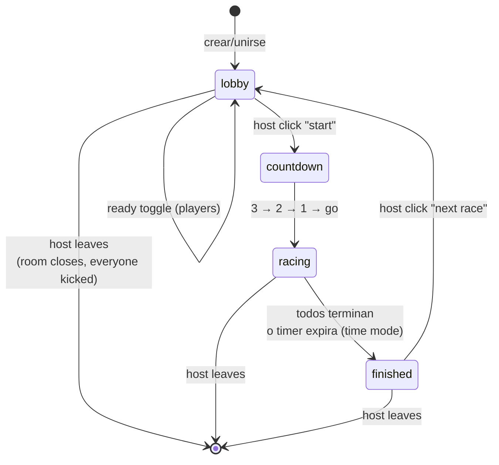

# keyduelo

> Carrera de tipeo multijugador en tiempo real, inspirada en [Monkeytype](https://monkeytype.com). Creá una sala pública, invitá a tus amigos por link y competí por el WPM más alto sobre el mismo texto — o entrá como espectador a cualquier sala activa y mirá la carrera en vivo.

**🟢 Demo en vivo:** https://type-multiplayer.vercel.app
**📦 Repo:** https://github.com/Jjat00/keyduelo

---

## Tabla de contenido

- [Características](#características)
- [Arquitectura](#arquitectura)
- [Modelo de roles: host, player, spectator](#modelo-de-roles-host-player-spectator)
- [Stack tecnológico](#stack-tecnológico)
- [Estructura del monorepo](#estructura-del-monorepo)
- [Desarrollo local](#desarrollo-local)
- [Variables de entorno](#variables-de-entorno)
- [Scripts disponibles](#scripts-disponibles)
- [Despliegue](#despliegue)
- [Roadmap](#roadmap)
- [Decisiones técnicas notables](#decisiones-técnicas-notables)

---

## Características

### Single player
- ⚡ **Solo-practice** sin login en `/` — empezá a tipear inmediatamente. `Tab` o `Esc` generan un texto nuevo.
- 🛠 **Configuraciones** — modo `words` (10/25/50/100) o modo `time` (15/30/60s), toggle de **puntuación**, persistencia en `localStorage`.

### Multijugador
- 👥 **Lobby público** en `/play` — lista de salas activas en tiempo real (polling cada 2s), entrada por un click. Podés unirte a salas en lobby como jugador o a salas en carrera como espectador.
- 🔗 **Crear sala con un click** — generás un código de 5 caracteres, te convertís en admin automáticamente. Copia-link y copia-código directo desde el header de la sala.
- 👑 **Modelo host/admin** — el que crea la sala controla todo: qué config se usa, cuándo arranca la carrera, a quién kickea.
- ⚙️ **Config server-side en vivo** — el host elige modo (words/time), cantidad y puntuación en el lobby; cambios se broadcastean a todos los jugadores y spectators en tiempo real.
- 👁 **Modo espectador** — cualquiera puede unirse como spectator (incluso a salas en medio de la carrera), ve las barras de progreso y el countdown sincronizado con los racers, sin participar.
- 🔒 **Host token persistente** — si refrescás la pestaña siendo host, seguís siéndolo (token efímero guardado en `localStorage` por código).
- 🚪 **Host sale → sala se cierra** — cuando el admin se desconecta, todos (players + spectators) reciben un aviso y vuelven al lobby. Rule claro, sin handoff confuso.
- 🏁 **Sincronización en tiempo real** vía WebSockets — texto, countdown y progreso de los rivales se ven en vivo con barras relativas al líder en time mode.
- 🎭 **Nickname opcional** — si no ponés ninguno, se te asigna un `guest####` automáticamente.

### UI / UX
- 📊 **Métricas estilo Monkeytype** — WPM (palabras por minuto), raw WPM, accuracy, tiempo total, ranking final.
- 🎨 **5 temas** — dracula (default), warm-dark, warm-light, nord, gruvbox-dark. Cambio en vivo + persistencia local.
- 🔊 **Sonidos de teclas opcionales** — 4 modos (off/click/mech/pop), generados con Web Audio API (sin descargas, sin samples). Errores tienen pitch más bajo para feedback audible.
- 📜 **Texto que scrollea** — el caret se ancla en la segunda línea del viewport y el texto fluye estilo Monkeytype, con fade en bordes.
- ✨ **Transiciones suaves** — fade entre lobby ↔ countdown ↔ race ↔ results.
- ♻️ **Estado autoritativo en el server** — el texto, el reloj y el ranking los decide el Durable Object, no el cliente. Imposible hacer trampa cambiando el reloj local.
- 🧱 **Time mode sincronizado** — en multiplayer, el countdown se ancla al `raceStartedAt` del server (no al primer keystroke local), así todos los participantes terminan al mismo wall-clock instant.

### Atajos de teclado

| Tecla | Contexto | Acción |
|---|---|---|
| `Tab` o `Esc` | Solo-practice (`/`) | Genera un texto nuevo |
| `Esc` | Theme / sound switcher abierto | Cierra el dropdown |

---

## Arquitectura



Dos Durable Objects con roles distintos:

- **`Room`** (uno por código de sala) — mantiene WebSockets activos, lista de players + spectators, config de carrera, estado (lobby/countdown/racing/finished), texto, hostToken. Accedido por `env.ROOM.getByName(code)`.
- **`RoomRegistry`** (singleton, nombre fijo `'global'`) — mantiene un `Map<code, RoomMeta>` con el estado resumido de cada sala activa para alimentar el lobby público. Se actualiza via RPC desde cada Room DO cada vez que hay un cambio relevante (join/leave/config/status). Servido al cliente a través del endpoint HTTP `GET /rooms`.

**Flujo de carrera multijugador:**



**Por qué Durable Objects (y no una DB):**
Cada sala es **un único DO** identificado por el código (`getByName(code)`). El runtime de Cloudflare garantiza una sola instancia activa de ese DO en todo el planeta — elimina la necesidad de Redis, pub/sub o sticky sessions. El DO mantiene en memoria la lista de jugadores, WebSockets activos (vía `acceptWebSocket` con hibernación nativa), estado de carrera, hostToken y config. Lo que debe sobrevivir la hibernación se persiste con `ctx.storage.put('room', ...)` como objeto atómico único.

Para la **lista pública de salas** evaluamos Postgres + Drizzle y lo descartamos: el estado es efímero por diseño (si el worker se reinicia, las WebSockets también caen), así que un singleton `RoomRegistry` DO cumple el rol nativo sin infra nueva. Las salas se re-registran automáticamente en su próximo evento.

---

## Modelo de roles: host, player, spectator

| Rol | Asignación | Puede | No puede |
|---|---|---|---|
| **host** | Primer joiner de la sala. Token rotativo server-generado, persistido en localStorage por código. | Cambiar config, iniciar carrera, kickear jugadores, iniciar next race | — |
| **player** | Joiners posteriores al primero. | Marcar ready, tipear durante la carrera, ver stats | Cambiar config, iniciar, kickear |
| **spectator** | Cualquiera que entre con `?spectate=1` (incluso a sala en racing). | Ver lista de players, ver progreso en vivo, ver countdown sincronizado | Typear, dar ready, ser rankeado |

**Mensajes del protocolo (resumen):**

Cliente → Server:

| Mensaje | Quién lo envía | Cuándo |
|---|---|---|
| `join` | Todos | Inmediatamente post-WebSocket open (con nickname + hostToken? + asSpectator?) |
| `ready` | players | Toggle de readiness en lobby |
| `start` | host | Inicia countdown manualmente |
| `update_config` | host | Cambia mode/count/punctuation (solo en lobby) |
| `kick` | host | Expulsa a un player por playerId |
| `progress` | players | Throttled 150ms durante racing |
| `finish` | players | Al completar el texto o agotar el tiempo |
| `next_race` | host | Resetea de `finished` a `lobby` |

Server → Cliente:

| Mensaje | Destinatarios | Payload clave |
|---|---|---|
| `joined` | self | `playerId`, `role`, `hostToken?` (solo al host), `room` |
| `room_state` | todos | snapshot completo del `RoomPublic` |
| `countdown` | todos | `secondsLeft` |
| `start` | todos | `startedAt`, `text` |
| `peer_progress` | otros + spectators | `playerId`, `charIndex`, `wpm` (alta frecuencia) |
| `race_end` | todos | `results[]` con ranking |
| `config_updated` | todos | nueva `RaceConfig` (redundante con room_state) |
| `kicked` | target | `reason`, seguido de close del socket |
| `error` | self | `code`, `message` |

---

## Stack tecnológico

| Capa | Tecnología | Por qué |
|---|---|---|
| Frontend framework | **Next.js 16** (App Router, RSC) | SSR + client components con división automática de bundles |
| UI runtime | **React 19** | Concurrency y compatibilidad con Next 16 |
| Tipado | **TypeScript 6** estricto (`noUncheckedIndexedAccess`, `verbatimModuleSyntax`) | Catch errors en build, no en runtime |
| Estilos | **Tailwind CSS v4** + CSS custom properties | Tokens de tema cambiables en runtime — alimenta el theme switcher (5 paletas) |
| Backend realtime | **Cloudflare Workers** + **Durable Objects** (Room + RoomRegistry) | WebSockets nativos en el edge, una instancia consistente por sala + lista global |
| Persistencia DO | **SQLite-backed** (`new_sqlite_classes`) + `ctx.storage.put` | Backend moderno y barato; room state ephemeral pero sobrevive hibernación |
| WebSocket | **Hibernation API** (`ctx.acceptWebSocket`) | Conexiones sobreviven hibernación del DO sin reconectar |
| Audio | **Web Audio API** (oscillators, noise, BiquadFilter) | Sonidos sintetizados en runtime, sin distribuir samples |
| Monorepo | **Turborepo** + **pnpm workspaces** | Tipos compartidos entre web y worker sin duplicación |
| Hosting web | **Vercel** | Compat 1:1 con Next.js 16, preview URLs por PR, auto-deploy desde GitHub |
| Hosting worker | **Cloudflare Workers Builds** | Edge global, free tier generoso, auto-deploy desde GitHub |

---

## Estructura del monorepo

```
keyduelo/
├── apps/
│   ├── web/                    # Next.js 16 client (Vercel)
│   │   ├── app/
│   │   │   ├── layout.tsx      # Root: ThemeProvider + Header + Footer + no-flash script
│   │   │   ├── globals.css     # CSS vars por tema, scroller, caret animation
│   │   │   ├── icon.png        # Favicon (detectado por convención de Next.js)
│   │   │   ├── apple-icon.png  # iOS home-screen icon
│   │   │   ├── page.tsx        # Solo-practice (/)
│   │   │   └── play/
│   │   │       ├── page.tsx    # Lobby público con lista de salas activas (/play)
│   │   │       └── [code]/
│   │   │           └── page.tsx # Sala multijugador (/play/XXXXX) con branch por rol
│   │   ├── components/
│   │   │   ├── Header.tsx      # Nav global + theme switcher + sound switcher
│   │   │   ├── Footer.tsx      # Link al repo en GitHub
│   │   │   ├── ConfigBar.tsx   # Bar de config (controlled opcional para host driven)
│   │   │   ├── HostControls.tsx # Config editable + start + kick por peer (solo host)
│   │   │   ├── CopyButton.tsx  # Copy a portapapeles con fallback execCommand
│   │   │   └── TypingArea.tsx  # Texto + scroller + caret + HUD con countdown
│   │   ├── lib/
│   │   │   ├── sound/
│   │   │   │   ├── types.ts           # SoundType ('off'|'click'|'mech'|'pop')
│   │   │   │   ├── storage.ts         # localStorage
│   │   │   │   ├── synth.ts           # Web Audio API: synth sin samples
│   │   │   │   └── SoundProvider.tsx  # Context + useSound hook (playKey estable)
│   │   │   ├── settings/
│   │   │   │   ├── types.ts           # Mode, WordCount, TimeSeconds, Settings
│   │   │   │   ├── storage.ts         # localStorage con validación por field
│   │   │   │   └── SettingsProvider.tsx
│   │   │   ├── theme/
│   │   │   │   ├── themes.ts          # 5 paletas (dracula default)
│   │   │   │   ├── storage.ts         # localStorage + applyTheme()
│   │   │   │   ├── ThemeProvider.tsx  # Context + useTheme hook
│   │   │   │   └── noFlashScript.ts   # Inline script blocking en <head>
│   │   │   ├── typing/
│   │   │   │   ├── engine.ts          # Máquina de estados pura (sin React)
│   │   │   │   └── useTypingEngine.ts # Hook con keyboard listener + forceFinish
│   │   │   ├── room/
│   │   │   │   ├── code.ts             # Generador + validador de códigos
│   │   │   │   ├── useRoomConnection.ts # Hook WebSocket (role, hostToken, kicked)
│   │   │   │   └── useRoomList.ts      # Polling de GET /rooms cada 2s
│   │   │   ├── storage/
│   │   │   │   ├── nickname.ts        # localStorage helper + generateGuestNickname
│   │   │   │   └── hostId.ts          # hostToken por código
│   │   │   └── config.ts              # WORKER_WS_URL + WORKER_HTTP_URL desde env
│   │   └── eslint.config.mjs
│   └── worker/                 # Cloudflare Worker (CF)
│       ├── src/
│       │   ├── index.ts        # Fetch handler: /health, /rooms, /room/:code/ws
│       │   ├── room.ts         # Room DO: lifecycle, host model, spectator, kick
│       │   └── registry.ts     # RoomRegistry DO: singleton con Map<code, RoomMeta>
│       └── wrangler.jsonc      # Config del worker + 2 DO bindings + migrations v1/v2
├── packages/
│   └── shared/                 # Tipos y protocolo compartidos
│       └── src/
│           ├── room.ts         # RoomStatus, PlayerPublic, PlayerRole, RaceConfig, RoomMeta
│           ├── protocol.ts     # ClientMessage / ServerMessage discriminated unions
│           ├── wordlist.ts     # 282 palabras inglesas comunes (selección propia)
│           └── textgen.ts      # generateText(count, {punctuation, rng})
├── turbo.json                  # Pipeline de build (shared antes que web)
├── pnpm-workspace.yaml         # Workspaces + onlyBuiltDependencies
└── package.json                # Root workspace
```

---

## Desarrollo local

### Prerrequisitos

- **Node.js** ≥ 20
- **pnpm** ≥ 10 (`npm install -g pnpm` o usar Corepack)
- (Opcional) **Cuenta de Cloudflare** + token de API si vas a deployar el worker

### Setup

```bash
git clone https://github.com/Jjat00/keyduelo.git
cd keyduelo
pnpm install
```

> ℹ️ **Nota Windows**: el proyecto está pensado para correr nativamente en Windows o macOS/Linux. Si usas WSL, instala `node_modules` desde WSL (los binarios nativos de `workerd`/`lightningcss` son específicos de plataforma).

### Levantar todo en paralelo

```bash
pnpm dev
```

Esto arranca via Turborepo:
- **Web** en http://localhost:3000 (Next.js dev server con Turbopack, bound a 127.0.0.1)
- **Worker** en http://localhost:8787 (wrangler dev con workerd local)

El cliente apunta automáticamente a `ws://localhost:8787` cuando no hay env var configurada, y `http://localhost:8787/rooms` para el polling del lobby.

### Probar el flujo multijugador en local

1. Abre http://localhost:3000/play en una ventana — podés dejar el nickname vacío (te asigna `guest####`) o poner el tuyo
2. Click "create new room" → te lleva a `/play/XXXXX` con rol host
3. Abre la misma URL en otra ventana (o http://localhost:3000/play en otro browser y tomá la sala del listado)
4. En la ventana host: cambiá la config a tu gusto → click "start race"
5. Opcionalmente abre una 3ra ventana y hacé click en "👁 spectate" en la lista para ver la carrera sin participar
6. Al terminar, el host clickea "next race" para volver a lobby

---

## Variables de entorno

### Web (`apps/web`)

Crea `apps/web/.env.local` (existe `.env.local.example` como plantilla):

```bash
# WebSocket URL al worker. Default si está vacío: ws://localhost:8787
NEXT_PUBLIC_WORKER_WS_URL=ws://localhost:8787
```

El cliente **deriva automáticamente** la URL HTTP del worker (`WORKER_HTTP_URL`) cambiando `ws://` por `http://` / `wss://` por `https://` — usada por el polling del lobby a `/rooms`. No hace falta una segunda env var.

En **producción** (Vercel), setear:
```
NEXT_PUBLIC_WORKER_WS_URL=wss://monkey-type-worker.<tu-subdominio>.workers.dev
```

> ⚠️ `NEXT_PUBLIC_*` se inlinea al bundle del cliente en build-time. Si la cambias, hay que rebuildear.

### Worker (`apps/worker`)

El worker no requiere env vars propias. Para deploy, exporta el token de Cloudflare en tu shell antes de `wrangler deploy`:

```bash
export CLOUDFLARE_API_TOKEN=tu_token_de_api
```

> 🔒 **Nunca commitees tokens al repo**. Usa env vars locales o secrets del hosting provider.

---

## Scripts disponibles

Todos corren via Turborepo desde la raíz:

| Comando | Qué hace |
|---|---|
| `pnpm dev` | Arranca web (3000) + worker (8787) en paralelo |
| `pnpm build` | Build de producción de todos los packages (respeta dependencias) |
| `pnpm typecheck` | `tsc --noEmit` en todos los packages |
| `pnpm lint` | ESLint en los packages con config |
| `pnpm clean` | Borra `.next/`, `dist/`, `.turbo/` y `node_modules/` |

**Por workspace** (con `--filter`):

```bash
pnpm --filter @monkey-type/web dev
pnpm --filter @monkey-type/worker exec wrangler deploy
pnpm --filter @monkey-type/shared typecheck
```

> Los prefijos `@monkey-type/*` son nombres internos de los packages pnpm. La app se llama **keyduelo** de cara al usuario; renombrar los paquetes internamente es un refactor aparte sin impacto user-facing.

---

## Despliegue

### Web → Vercel

1. **Importar repo** en https://vercel.com/new → seleccionar `keyduelo`
2. Config:
   - **Framework**: Next.js (auto-detected)
   - **Root Directory**: `apps/web` (importante)
   - **Build / Install commands**: defaults (Vercel detecta pnpm + workspace de Turbo)
3. **Environment Variables**: agregar `NEXT_PUBLIC_WORKER_WS_URL=wss://...` para Production / Preview / Development
4. **Deploy**

Vercel auto-deploya en cada push a `main`.

### Worker → Cloudflare

```bash
cd apps/worker
export CLOUDFLARE_API_TOKEN=tu_token  # template "Editar Cloudflare Workers"
pnpm exec wrangler deploy
```

Output:
```
Deployed monkey-type-worker triggers (0.99 sec)
  https://monkey-type-worker.<tu-subdominio>.workers.dev
```

**Verificar:**
```bash
curl https://monkey-type-worker.<tu-subdominio>.workers.dev/health
# → ok

curl https://monkey-type-worker.<tu-subdominio>.workers.dev/rooms
# → [] (o la lista de salas activas)
```

**Auto-deploy desde GitHub** (recomendado y ya configurado):
- `dash.cloudflare.com` → Workers & Pages → `monkey-type-worker` → Settings → Build → **Connect to Git**
- Repo: `Jjat00/keyduelo`, branch: `main`, root directory: `apps/worker`

> El nombre del worker (`monkey-type-worker`) es el identifier en Cloudflare; renombrarlo implica re-deploy en un nuevo URL + actualizar `NEXT_PUBLIC_WORKER_WS_URL` en Vercel. Lo dejamos así hasta que haya dominio custom (`worker.keyduelo.io`).

---

## Roadmap

| Fase | Descripción | Estado |
|---|---|---|
| 1 | Scaffold del monorepo (Next + Worker + shared) | ✅ |
| 2 | Solo-practice typing engine (state machine + caret + métricas) | ✅ |
| 3a | Lobby multijugador (join/ready/disconnect en tiempo real) | ✅ |
| 3b | Race lifecycle (countdown → race → results → next race) | ✅ |
| 4 | Polish visual (theme switcher, header global, transiciones, scrolling text) | ✅ |
| 5 | Despliegue a producción (Cloudflare + Vercel) con auto-deploy | ✅ |
| 6 | Salas públicas con admin model (RoomRegistry DO, spectators, live config, host kick/start, optional nickname, rebrand a keyduelo, favicon) | ✅ |

---

## Decisiones técnicas notables

### Por qué Cloudflare Workers + Durable Objects en vez de un servidor Node tradicional

- **Una instancia por sala, automática**: `env.ROOM.getByName(roomCode)` garantiza que dos clientes con el mismo código siempre golpean el mismo DO. Sin esto necesitaríamos sticky sessions o Redis pub/sub.
- **WebSockets con hibernación**: el DO duerme cuando todos los clientes están idle pero las conexiones siguen abiertas. Costo cero cuando no hay actividad.
- **Edge deployment**: el DO se asigna al edge más cercano al primer cliente que lo crea, minimizando RTT de los keystrokes.
- **Free tier**: 100K requests/día y 13M ms de CPU/día, más que suficiente para MVP y comunidades pequeñas.

### Por qué RoomRegistry DO singleton en vez de Postgres para la lista de salas

La lista pública de salas es **estado efímero por naturaleza**: si el worker se reinicia, las WebSockets también caen y los clientes reconectan, re-registrándose automáticamente. Postgres + un ORM como Drizzle aportan persistencia transaccional que acá no paga su costo operacional. En su lugar usamos un DO singleton (`env.ROOM_REGISTRY.getByName('global')`) que mantiene un `Map<code, RoomMeta>` en memoria. Latencia <10ms desde cualquier worker en el mismo edge, y cero infra nueva. Postgres queda como opción futura cuando haya datos que deban sobrevivir reinicios (cuentas de usuario, leaderboards, historial de partidas).

### Por qué el host se identifica con un `hostToken` (y no auth real)

Sin cuentas de usuario todavía, el admin de una sala se identifica con un token de 32 bytes random que el server genera y entrega **solo** al primer joiner (o al reclamante que provea el token correcto). El cliente lo guarda en `localStorage[mtmp:hostTokens][code]`. Al refrescar la pestaña, lo envía de vuelta en `join` y el server re-grantea el rol.

Es el patrón capability-based de un share-link de Google Docs aplicado a sesiones efímeras: no preguntamos "¿quién sos?", preguntamos "¿tenés la prueba de que creaste esto?". Blast radius si se filtra: UNA sala efímera. El token rota en cada reasignación (handoff o re-claim) para neutralizar tokens filtrados.

### Por qué "host sale → sala se cierra" en vez de promover al siguiente player

El modelo de handoff (promover al peer más antiguo) parece UX-amigable pero genera confusión: el promovido no pidió el rol y ahora tiene responsabilidad sobre start/kick/config. En cambio, el modelo explícito de "sin host, no hay sala" es más claro — si el creador se desconecta, todos reciben `{ type: 'kicked', reason: 'Host left the room' }` y vuelven a `/play` con un toast. Los peers saben que pueden crear su propia sala. Menos edge cases, modelo mental más simple.

### Por qué el time mode en multiplayer se ancla al server, no al primer keystroke

En solo-practice, el countdown arranca con el primer keystroke del jugador — lógico para práctica individual. En multiplayer eso sería injusto: alguien que demora 5s antes de tipear tendría 5s más de carrera efectiva. El `useServerCountdown` (en `apps/web/app/play/[code]/page.tsx`) calcula `Date.now() - raceStartedAt` tickeando cada 200ms, y el `forceFinish()` del `useTypingEngine` fuerza el fin local exactamente cuando `raceStartedAt + timeSeconds * 1000` se cumple. Todos los clientes terminan al mismo wall-clock instant (±jitter de red).

### Por qué dos canales de estado (room_state vs peer_progress)

- **`room_state`**: snapshot completo de la sala, broadcast solo en eventos importantes (join, ready toggle, config change, finish). Bajo throughput.
- **`peer_progress`**: mensaje ligero (charIndex + wpm) cada 150ms por jugador. Alto throughput pero payload mínimo.

Esto evita re-broadcastear el snapshot completo de la sala en cada keystroke, ahorrando bandwidth y CPU del DO. En racing, `peer_progress` también se replica a spectators para que vean las barras en vivo.

### Por qué un motor de tipeo puro separado de React

`apps/web/lib/typing/engine.ts` es una máquina de estados sin imports de React. Eso permite:
- **Tests unitarios triviales** (próximo en backlog)
- **Reuso server-side** para validación anti-cheat futura
- **Mutaciones rápidas**: el hook lo usa con un `useRef` para evitar batching de keystrokes bajo carga (los `setState` de React 18 podían perder caracteres a >100 wpm)

### Por qué el theme system usa CSS custom properties (no Tailwind dark mode)

Tailwind solo soporta 2 modos (`dark:` prefix). Para 5+ temas necesitamos vars CSS — exactamente lo que tiene `globals.css`. Cambiar tema = sobrescribir `--color-*` en `<html>` → todas las utilidades Tailwind se actualizan sin re-renderizar React.

Para evitar el "flash of default theme" cuando un usuario tiene un tema custom guardado, hay un **script inline blocking** en `<head>` (`lib/theme/noFlashScript.ts`) que lee `localStorage` y aplica las vars antes de que React hidrate. Es el mismo patrón que usa `next-themes`. Tradeoff: ~1KB inline en cada response, eliminado el flash visual.

### Por qué el caret vive fuera del scroller del texto

El `TypingArea` usa un wrapper interno con `transform: translateY(...)` para scrollear texto estilo Monkeytype (caret anclado en línea 2). Si el caret estuviera dentro del wrapper, se traduciría junto con él (doble movement) y se clipearía por el `overflow: hidden` del scroller. Lo dejé fuera, en el container relative parent — su `getBoundingClientRect` sigue tracking el span target (que sí está dentro del wrapper traducido), así que el caret se posiciona correctamente sin clip.

### Por qué `useSearchParams` vive dentro de `<Suspense>`

Next.js 16 hace prerender estático agresivo; cualquier componente que use `useSearchParams()` directamente fuerza un CSR bailout durante el build. Wrappeando el componente dentro de `<Suspense fallback={null}>` se separa la sección que depende de query params del árbol prerenderable — el build pasa y el browser hidrata esa parte después. Aplicado en `/play` y `/play/[code]`.

### Por qué desactivamos algunas reglas de `react-hooks` v6

`react-hooks/purity`, `react-hooks/refs` y `react-hooks/set-state-in-effect` (nuevas en eslint-plugin-react-hooks v6+) rechazan tres patrones legítimos que usamos:
1. **Ref-as-state** en `useTypingEngine` — optimización medida para no perder keystrokes
2. **`setState` post-mount** para hidratar desde `localStorage` — evita SSR/CSR mismatch
3. **`performance.now()` en render** para métricas live — ningún state deriva de eso

Justificación documentada en `apps/web/eslint.config.mjs`.

---

## Acknowledgements

Este proyecto está **inspirado** en [Monkeytype](https://github.com/monkeytypegame/monkeytype) (también GPL-3.0). No incluye código fuente de Monkeytype — el motor, los hooks, los componentes, el worker y el protocolo se escribieron desde cero. La wordlist (`packages/shared/src/wordlist.ts`) es selección y orden propios. Los temas `warm-dark` y `warm-light` están inspirados en el tema `serika` de Monkeytype pero llevan nombres y atribución distintos.

Paletas de color de terceros incluidas:
- **nord** — [Nord theme](https://www.nordtheme.com) por Sven Greb (MIT)
- **dracula** — [Dracula theme](https://draculatheme.com) por Zeno Rocha (MIT)
- **gruvbox** — [Gruvbox theme](https://github.com/morhetz/gruvbox) por Pavel Pertsev / morhetz (MIT)

El nombre y logo de Monkeytype son marcas del proyecto Monkeytype; este repositorio no usa ninguno.

## Licencia

[GPL-3.0](LICENSE) — software libre con copyleft. Podés usar, modificar y redistribuir el código bajo los mismos términos. Cualquier derivado distribuido también debe liberarse bajo GPL-3.0 con su código fuente disponible.
